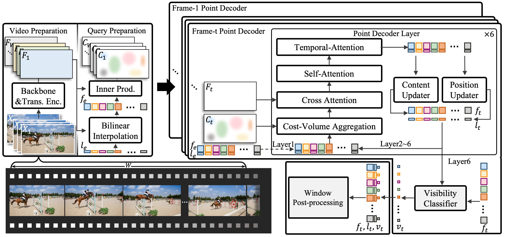
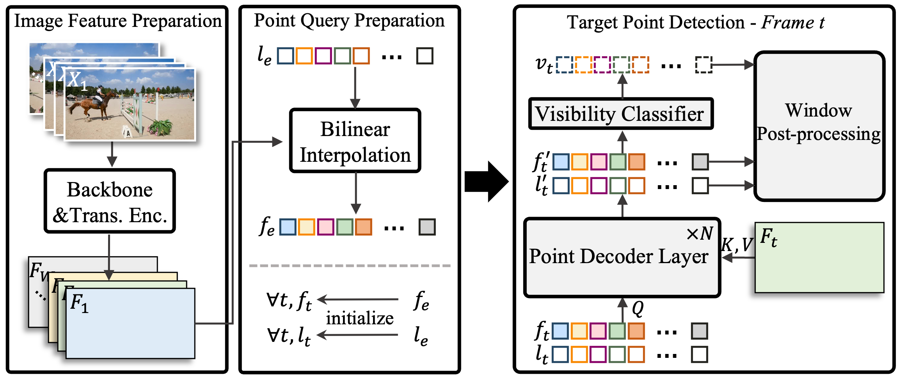
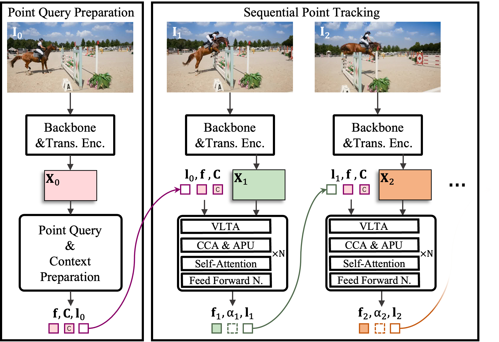

# TAPTR: **T**racking **A**ny **P**oint **TR**ansformers

We open-source TAPTRv1, TAPTRv2, and TAPTRv3 (not yet) in this repository. You can find them in their corresponding branches.

These works are completed by [Hongyang Li](https://scholar.google.com.hk/citations?view_op=list_works&hl=zh-CN&user=zdgHNmkAAAAJ&gmla=AMpAcmTJNHoetv6zgfzZkIRcYsFr0UkGGDyl5tAp5etuBqhz3lzYZCQrVDot02xVQ1XTbnMS1fPdAfe0-2--aTXOtewokjyShNLOQQyyhtkolwaz0hvENZpi-pJ-Wg), [Jinyuan Qu](https://scholar.google.com/citations?user=-RSeOl0AAAAJ&hl=zh-CN), [Hao Zhang](https://scholar.google.com/citations?user=B8hPxMQAAAAJ&hl=zh-CN), [Shilong Liu](https://scholar.google.com/citations?hl=zh-CN&user=nkSVY3MAAAAJ), [Zhaoyang Zeng](https://scholar.google.com.hk/citations?user=U_cvvUwAAAAJ&hl=zh-CN&oi=sra), [Tianhe Ren](https://scholar.google.com.hk/citations?user=cW4ILs0AAAAJ&hl=zh-CN&oi=sra), [Feng Li](https://scholar.google.com.hk/citations?user=ybRe9GcAAAAJ&hl=zh-CN&oi=sra), [Bohan Li](https://scholar.google.com.hk/citations?hl=zh-CN&user=V-YdQiAAAAAJ) and [Lei Zhang](https://scholar.google.com/citations?hl=zh-CN&user=fIlGZToAAAAJ) <sup>:email:</sup>.

### Paper Links: [TAPTRv1](https://arxiv.org/pdf/2403.13042) | [TAPTRv2](https://arxiv.org/abs/2407.16291) | [TAPTRv3](https://arxiv.org/abs/2411.18671)
### More Links: [TAPTR Project Page](https://taptr.github.io) | [Demo (v3)](https://huggingface.co/spaces/HYeungLee/TAPTR) | [BibTeX](#citing-taptr) | [IDEA-Research](https://github.com/IDEA-Research)


# :fire: News

[2024/11/28] We release our TAPTRv3 paper.

[2024/11/25] TAPTRv2's code is released.

[2024/9/26] TAPTRv2 is accepted by NeurIPS2024.

[2024/7/24] We release our TAPTRv2 paper.

[2024/7/16] TAPTRv1's code is released. 

[2024/7/9] TAPTRv1 is accepted by ECCV2024.

[2024/3/15] We release our TAPTRv1 paper.


# :dna: What is TAPTR.
Inspired by recent visual prompt-based detection [1], we propose to convert Track Any Point (TAP) task to point-level visual prompt detection task. Building upon the recent advanced DEtection TRansformer (DETR) [2, 3, 4, 5], we propose our Track Any Point TRansformer (TAPTR).

[1] T-rex2: Towards Generic Object Detection via Text-visual Prompt Synergy. IDEA-Research. ECCV2024.

[2] DAB-DETR: Dynamic Anchor Boxes are Better Queries for DETR. IDEA-Research. ICLR2022.

[3] DN-DETR: Accelerate DETR Training by Introducing Query DeNoising. IDEA-Research. CVPR2022.

[4] DINO: DETR with Improved DeNoising Anchor Boxes for End-to-End Object Detection. IDEA-Research. ICLR2023.

[5] DINO-X: A Unified Vision Model for Open-World Object Detection and Understanding. IDEA-Research. ArXiv2024.

# :footprints: From V1 to V3, a brief overview.

### TAPTRv1 - Simple yet strong baseline.
TAPTRv1 first proposes to address TAP task __from the perspective of detection__. Instead of building upon the traditional optical flow methods, TAPTRv1 is also the first propose to adopt the more advanced DETR-like framework for TAP task. Compared with previous methods, TAPTRv1 has a __clearer and simpler definition of point query and better performance__.

_Although TAPTRv1 achieves SoTA performance with the DETR-like framework, TAPTRv1 still needs the source-consuming cost-volume to obtain its optimal performance._

<div align="center">
  
</div>

### TAPTRv2 - Simpler and stronger.
TAPTRv2 finds that the reliance of cost-volume stems from the __domain gap between training and evaluation data__. The use of cost-volume in TAPTRv1 will also __contaminate the point query__. TAPTRv2 finds that the __attention weights and cost-volume are essentially the same__ (attention weights in key-aware deformable cross attention can be regarded as sparse cost-volume). TAPTRv2 proposes the __Attention-based Position Update (APU)__ to utilize this domain-agnostic information while preventing point queries from being contaminated. The elimination of cost-volume makes TAPTRv2 __unifies__ the framework of both object-level and point-level perception.

_Although TAPTRv2 achieves simpler framework and better performance, TAPTRv2’s performance in long videos is still not satisfying._

<div align="center">
  
</div>

### TAPTRv3 - Much stronger, especially on long-term tracking.
TAPTRv3 finds that the poor performance of TAPTRv2 on long videos is due to its shortage of feature querying in both spatial and temporal dimensions in long videos. For __better temporal feature querying__, instead of utilizing the RNN-like long-temporal modeling, TAPTRv3 extends the temporal attention from a small window to arbitrary length while considering the target tracking points' visibility, and proposes the __Visibility-aware Long-Temporal Attention__ (VLTA). For __better spatial feature querying__, TAPTRv3 utilizes the spatial context to improve the quality of attention weights in cross attention, and proposes the __Context-aware Cross Attention__ (CCA). To help TAPTRv3 reestablish tracking when a scene cut occurs with sudden large motion, which is quite prevalent in long-term videos, TAPTRv3 proposes to __trigger global matching module to reset point queries' initial locations when a scene cut is detected__. __TAPTRv3 achieves SoTA performance on almost all TAP datasets, even when compared with methods trained on large-scale extra internal data, TAPTRv3 is still competitive.__

<div align="center">
  
</div>


# :100: Performance

<div align="center">
  
</div>

Through three versions of optimization, TAPTRv3 achieves state-of-the-art performance. Even when compared with methods trained on large-scale extra internal data (we only train TAPTRv3 on a small synthetic dataset, while BootsTAPIR and CoTracker3 are refined on their large-scale internal real-world dataset), TAPTRv3 is still competitive.

# :spiral_calendar: Future work and collaboration opportunities.
1. Extend TAPTR to Track Any Visual Prompt TRansformer (TAVTR).
2. Exploring the application of TAPTR in embodied AI scenarios.

If you have any interest in collaboration, feel free to contact us!


# :herb: Acknowledgments
We would like to thank [TAP-Vid](https://github.com/google-deepmind/tapnet) and [Co-Tracker](https://github.com/facebookresearch/co-tracker) for publicly releasing their code and data. 

# :black_nib: Citation

```
@inproceedings{li2024taptr,
  title={{TAPTR: Tracking Any Point with Transformers as Detection}},
  author={Li, Hongyang and Zhang, Hao and Liu, Shilong and Zeng, Zhaoyang and Ren, Tianhe and Li, Feng and Zhang, Lei},
  booktitle={European Conference on Computer Vision},
  pages={57--75},
  year={2024},
  organization={Springer}
}
@article{li2024taptrv2
  title={{TAPTRv2: Attention-based Position Update Improves Tracking Any Point}},
  author={Li, Hongyang and Zhang, Hao and Liu, Shilong and Zeng, Zhaoyang and Li, Feng and Ren, Tianhe and Li, Bohan and Zhang, Lei},
  journal={Advances in Neural Information Processing Systems},
  year={2024}
}
@article{Qu2024taptrv3,
  title={{TAPTRv3: Spatial and Temporal Context Foster Robust Tracking of Any Point in Long Video}},
  author={Qu, Jinyuan and Li, Hongyang and Liu, Shilong and Zeng, Zhaoyang and Ren, Tianhe and Zhang, Lei},
  journal={arXiv preprint},
  year={2024}
}
```
