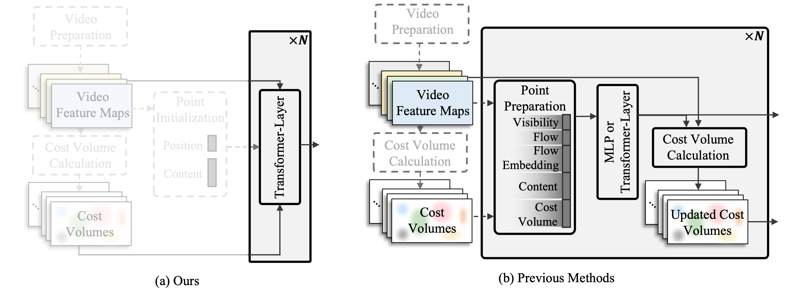
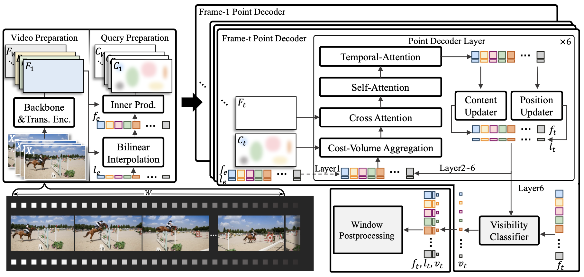
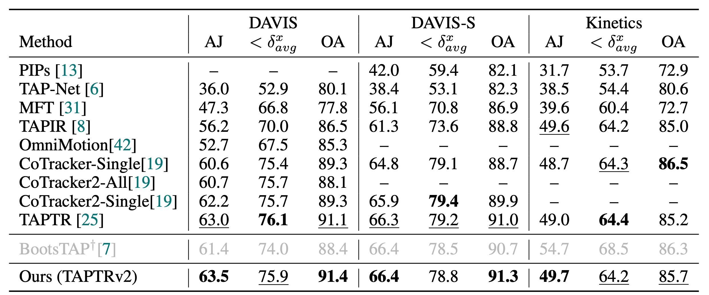
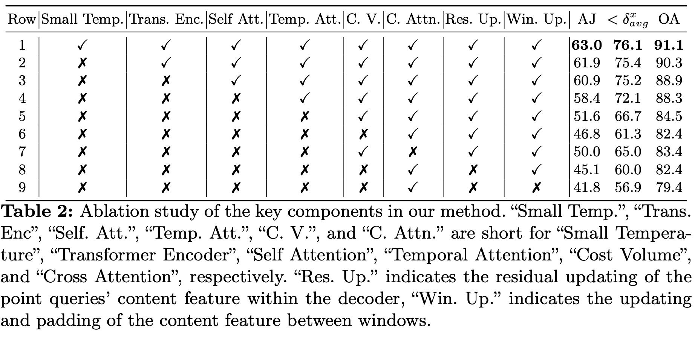
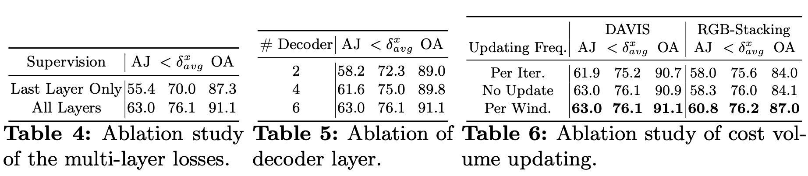

# TAPTR: **T**racking **A**ny **P**oint with **TR**ansformers as Detection

By [Hongyang Li](https://scholar.google.com.hk/citations?view_op=list_works&hl=zh-CN&user=zdgHNmkAAAAJ&gmla=AMpAcmTJNHoetv6zgfzZkIRcYsFr0UkGGDyl5tAp5etuBqhz3lzYZCQrVDot02xVQ1XTbnMS1fPdAfe0-2--aTXOtewokjyShNLOQQyyhtkolwaz0hvENZpi-pJ-Wg), [Hao Zhang](https://scholar.google.com/citations?user=B8hPxMQAAAAJ&hl=zh-CN), [Shilong Liu](https://scholar.google.com/citations?hl=zh-CN&user=nkSVY3MAAAAJ), [Zhaoyang Zeng](https://scholar.google.com.hk/citations?user=U_cvvUwAAAAJ&hl=zh-CN&oi=sra), [Tianhe Ren](https://scholar.google.com.hk/citations?user=cW4ILs0AAAAJ&hl=zh-CN&oi=sra), [Feng Li](https://scholar.google.com.hk/citations?user=ybRe9GcAAAAJ&hl=zh-CN&oi=sra), and [Lei Zhang](https://scholar.google.com/citations?hl=zh-CN&user=fIlGZToAAAAJ) <sup>:email:</sup>.

### [Project Page](https://taptr.github.io) | [Demo-PointTrajectory](https://taptr-trajectory.deepdataspace.com) | [Demo-VideoEditing](https://taptr-videoediting.deepdataspace.com) | [Arxiv](xxx) | [BibTeX](#citing-taptr)
[](https://github.com/IDEA-Research/TAPTR/assets/89394032/036503fe-bb4c-4804-affc-c606fd93878f)

# :fire: News
[2024/3/15] We release our paper.

[2024/7/9] TAPTR is accepted by ECCV2024.


# :spiral_calendar: TODO List
- [x] Release paper.
- [x] Release online demos.
- [x] Open-source evaluation and demo code.
- [x] Training code.
- [ ] Clean code. (30% cleaned).


# :scroll: Abstract
In this paper, we propose a simple and strong framework for **T**racking **A**ny **P**oint with **TR**ansformer (**TAPTR**). Based on the observation that point tracking bears a great resemblance to object detection and tracking, we borrow designs from DETR-like algorithms to address the task of TAP. In the proposed framework, each tracking point is represented as a DETR query, which consists of a positional part and a content part. As in DETR, each query (its position and content feature) is naturally updated layer by layer. Its visibility is predicted by its updated content feature. Queries belonging to the same tracking point can exchange information through temporal self-attention. As all such operations are well-designed in DETR-like algorithms, the model is conceptually very simple.  We also adopt some useful designs such as cost volume from optical flow models and develop simple designs to mitigate the feature drifting issue. Our framework demonstrates strong performance with state-of-the-art performance on various TAP datasets with faster inference speed. 


# :hammer_and_wrench: Method
## Comparison with previous methods

Inspired by detection transformer (DETR), we find that point tracking bears a great resemblance to object detection and tracking. In particular, tracking points can be essentially regarded as queries, which have been extensively studied in DETR-like algorithms.
The well-studied DETR-like framework makes our TAPTR conceptually simple yet performance-wise strong. 

## Overview

The video preparation and query preparation parts provide the multi-scale feature map, point queries, and the cost volumes for the point decoder. The point decoder takes these elements as input and processes all frames in parallel. The outputs of the point decoder are sent to our window post-processing module to update the states of the point queries to their belonging tracking points.

# Performance

We evaluate TAPTR on the TAP-Vid benchmark to show its superiority. As shown in the tabel, TAPTR shows significant superiority compared with previous SoTA methods across the majority of metrics while maintins the advantage in inference speed.
To evaluate the tracking speed of different methods fairly, we compare the Point Per Second (PPS), which is the average number of points that a tracker can track across the entire video per second on the DAVIS dataset in the ``First'' mode.


# Extensive Ablations


As a baseline method, as shown in the tables, we provide extensive ablation studies to verify the effectiveness of each key component in TAPTR, providing references for future work.

# :gear: Usage 
We develop and test our method under ```python=3.8.13,pytorch=1.9.1,cuda=11.1```. Other versions might be available as well.

## Prepare datasets
Construct the dataset as in [CoTracker](https://github.com/facebookresearch/co-tracker), and put it at 
```
kubric data (for training): ./data/kubric_movif/
tapvid data (for evaluation): 
    ./data/tapvid/tapvid_davis
    ./data/tapvid/tapvid_kinetics
    ./data/tapvid/tapvid_rgb_stacking
```

## Installation
```sh
git https://github.com/IDEA-Research/TAPTR.git
cd TAPTR/
```

## Eval our pretrianed models
Download our provided [checkpoint](), and put it at "logs/TAPTR/taptr.pth"
```sh
# Select the dataset you want to evaluate in evaluate.sh manually. 
bash evaluate.sh
```
## Train the models
```sh
bash dist_train.sh
```

# :black_nib: Citation

```
@inproceedings{
  title={TAPTR: Tracking Any Point with Transformers as Detection},
  author={Hongyang Li and Hao Zhang and Shilong Liu and Zhaoyang Zeng and Tianhe Ren and Feng Li and Lei Zhang},
  booktitle={Proceedings of the IEEE/CVF European Conference on Computer Vision},
  year={2024}
}
```