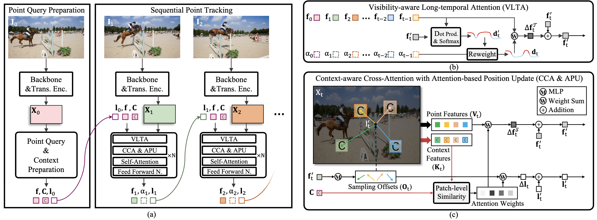
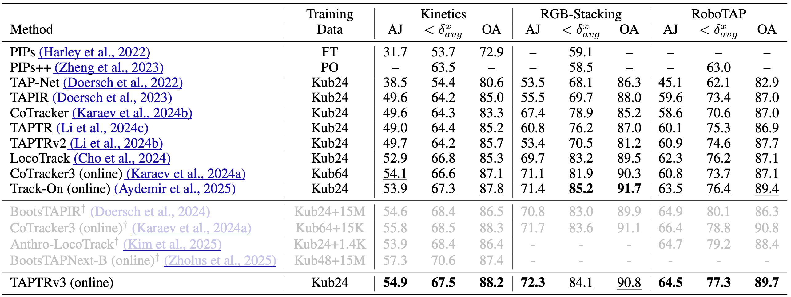

# TAPTRv3: Spatial and Temporal Context Foster Robust Tracking of Any Point in Long Video

By [Jinyuan Qu](https://scholar.google.com/citations?user=-RSeOl0AAAAJ), [Hongyang Li](https://scholar.google.com.hk/citations?view_op=list_works&hl=zh-CN&user=zdgHNmkAAAAJ&gmla=AMpAcmTJNHoetv6zgfzZkIRcYsFr0UkGGDyl5tAp5etuBqhz3lzYZCQrVDot02xVQ1XTbnMS1fPdAfe0-2--aTXOtewokjyShNLOQQyyhtkolwaz0hvENZpi-pJ-Wg), [Shilong Liu](https://scholar.google.com/citations?hl=zh-CN&user=nkSVY3MAAAAJ), [Tianhe Ren](https://scholar.google.com.hk/citations?user=cW4ILs0AAAAJ&hl=zh-CN&oi=sra), [Zhaoyang Zeng](https://scholar.google.com.hk/citations?user=U_cvvUwAAAAJ&hl=zh-CN&oi=sra) and [Lei Zhang](https://scholar.google.com/citations?hl=zh-CN&user=fIlGZToAAAAJ).

### [Project Page](https://taptr.github.io) | [TAPTR](https://arxiv.org/abs/2403.13042) | [TAPTRv2](https://arxiv.org/abs/2403.13042) | [TAPTRv3](https://arxiv.org/abs/2411.18671)

## Abstract

In this paper, built upon TAPTRv2, we present TAPTRv3. TAPTRv3 improves TAPTRv2 by addressing its shortage in querying high quality features from long videos, where the target tracking points normally undergo increasing variation over time. In TAPTRv3, we propose to utilize both spatial and temporal context to bring better feature querying along the spatial and temporal dimensions for more robust tracking in long videos. For better spatial feature querying, we identify that off-the-shelf attention mechanisms struggle with point-level tasks and present Context-aware Cross-Attention (CCA). CCA introduces spatial context into the attention mechanism to enhance the quality of attention scores when querying image features. For better temporal feature querying, we introduce Visibility-aware Long-Temporal Attention (VLTA), which conducts temporal attention over all past frames while considering their corresponding visibilities. This effectively addresses the feature drifting problem in TAPTRv2 caused by its RNN-like long-term modeling. TAPTRv3 surpasses TAPTRv2 by a large margin on most of the challenging datasets and obtains state-of-the-art performance. Even when compared with methods trained on large-scale extra internal data, TAPTRv3 still demonstrates superiority.



## Installation

We develop and test our method under ```python=3.8.18,pytorch=1.13.0+cu117,cuda=11.7```. Other versions might be available as well.

```sh
git clone https://github.com/IDEA-Research/TAPTR.git
cd TAPTR
git checkout v3
pip install -r requirements.txt
cd models/dino/ops
python setup.py install # This compilation requires nvcc, please make sure you have installed CUDA correctly. CUDA11.7 is tested.
```

## Prepare datasets
Construct the dataset as in [CoTracker](https://github.com/facebookresearch/co-tracker), and put it at:

```text
kubric data (for training): ./datas/kubric_movif/
tapvid data (for evaluation): 
    ./datas/tapvid/tapvid_davis
    ./datas/tapvid/tapvid_kinetics
    ./datas/tapvid/tapvid_rgb_stacking
    ./datas/tapvid/robotap
```

## Models

We provide the configuration files and checkpoints as below.

<table>
<thead>
<tr>
<th rowspan="2" style="text-align:center;vertical-align:middle;">Config</th>
<th colspan="3" style="text-align:center;vertical-align:middle;">Kinetics</th>
<th colspan="3" style="text-align:center;vertical-align:middle;">RGB-Stacking</th>
<th colspan="3" style="text-align:center;vertical-align:middle;">RoboTAP</th>
<th colspan="3" style="text-align:center;vertical-align:middle;">DAVIS</th>
<th rowspan="2" style="text-align:center;vertical-align:middle;">Checkpoint</th>
</tr>
<tr>
<th style="text-align:center;vertical-align:middle;">AJ</th><th style="text-align:center;vertical-align:middle;"><span style="white-space:nowrap;">δ<sup>x</sup><sub>avg</sub></span></th><th style="text-align:center;vertical-align:middle;">OA</th>
<th style="text-align:center;vertical-align:middle;">AJ</th><th style="text-align:center;vertical-align:middle;"><span style="white-space:nowrap;">δ<sup>x</sup><sub>avg</sub></span></th><th style="text-align:center;vertical-align:middle;">OA</th>
<th style="text-align:center;vertical-align:middle;">AJ</th><th style="text-align:center;vertical-align:middle;"><span style="white-space:nowrap;">δ<sup>x</sup><sub>avg</sub></span></th><th style="text-align:center;vertical-align:middle;">OA</th>
<th style="text-align:center;vertical-align:middle;">AJ</th><th style="text-align:center;vertical-align:middle;"><span style="white-space:nowrap;">δ<sup>x</sup><sub>avg</sub></span></th><th style="text-align:center;vertical-align:middle;">OA</th>
</tr>
</thead>
<tbody>
<tr>
<td align="center"><a href="config/TAPTRv3_resnet50_512x512.py">TAPTRv3 (Resnet-50, 512 × 512)</a></td>
<td align="center">54.5</td><td align="center"><b>67.5</b></td><td align="center"><b>88.2</b></td>
<td align="center"><b>73.0</b></td><td align="center"><b>86.2</b></td><td align="center">90.0</td>
<td align="center"><b>64.6</b></td><td align="center">77.2</td><td align="center"><b>90.1</b></td>
<td align="center"><b>63.2</b></td><td align="center"><b>76.7</b></td><td align="center"><b>91.0</b></td>
<td align="center"> <a href="https://drive.google.com/file/d/19iql2VTqGIeoyg_wt3JjpohszN5UE6s1/view?usp=drive_link">model</a> </td>
</tr>
<tr>
<td align="center"><a href="config/TAPTRv3_resnet18_384x512.py">TAPTRv3 (Resnet-18, 384 × 512)</a></td>
<td align="center"><b>54.9</b></td><td align="center"><b>67.5</b></td><td align="center"><b>88.2</b></td>
<td align="center">72.3</td><td align="center">84.1</td><td align="center"><b>90.8</b></td>
<td align="center">64.5</td><td align="center"><b>77.3</b></td><td align="center">89.7</td>
<td align="center"><b>63.2</b></td><td align="center">76.4</td><td align="center">90.6</td>
<td align="center"> <a href="https://drive.google.com/file/d/1frPX9R_nKDG8FmL-vH6l_2HsJfhvEjtg/view?usp=drive_link">model</a> </td>
</tr>
</tbody>
</table>

## Evaluation

Download our provided checkpoints, and put them at "logs/TAPTRv3/".
For TAPTRv3, we provide inference in streaming manner by default, i.e., with the --streaming flag enabled.

```sh
# Select the dataset and config you want to evaluate in evaluate.sh manually. 
bash evaluate.sh
```

## Train our models

```sh
bash dist_train.sh
```

## Performance



## Citation

```text
@article{qu2024taptrv3,
  title={{TAPTRv3: Spatial and Temporal Context Foster Robust Tracking of Any Point in Long Video}},
  author={Qu, Jinyuan and Li, Hongyang and Liu, Shilong and Ren, Tianhe and Zeng, Zhaoyang and Zhang, Lei},
  journal={arXiv preprint arXiv:2411.18671},
  year={2024}
}
```

## Acknowledgments

We would like to thank [TAP-Vid](https://github.com/google-deepmind/tapnet) and [Co-Tracker](https://github.com/facebookresearch/co-tracker) for publicly releasing their code and data. 